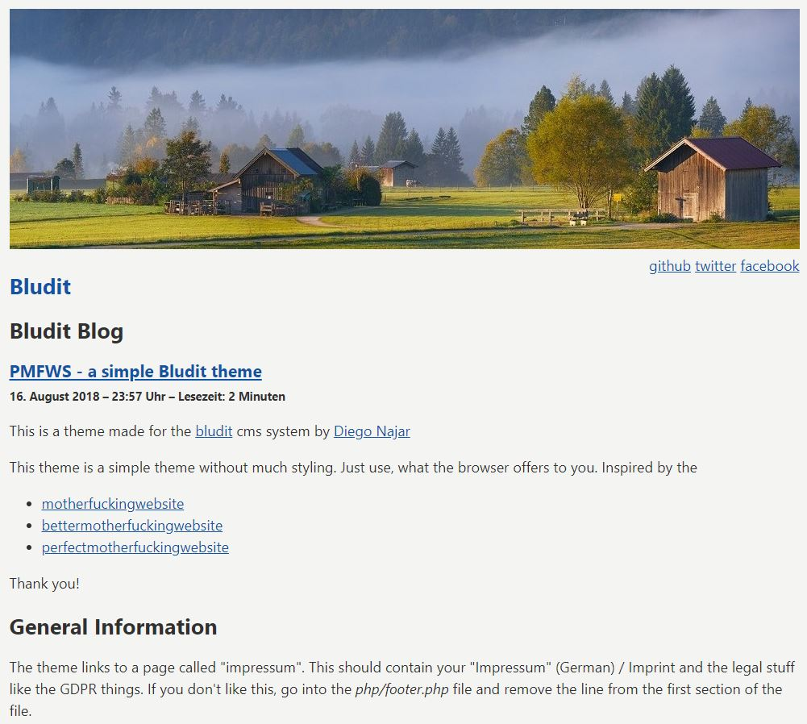

# zn80net

This is a theme made for the [bludit] cms system by [Diego Najar][bludit]

This theme is a simple theme without much styling. Just use, what the browser offers to you.

## General Information

## Plugins

This theme does not use any special plugins.

## Header Image

## Screenshot

[bludit]:https://www.bludit.com
